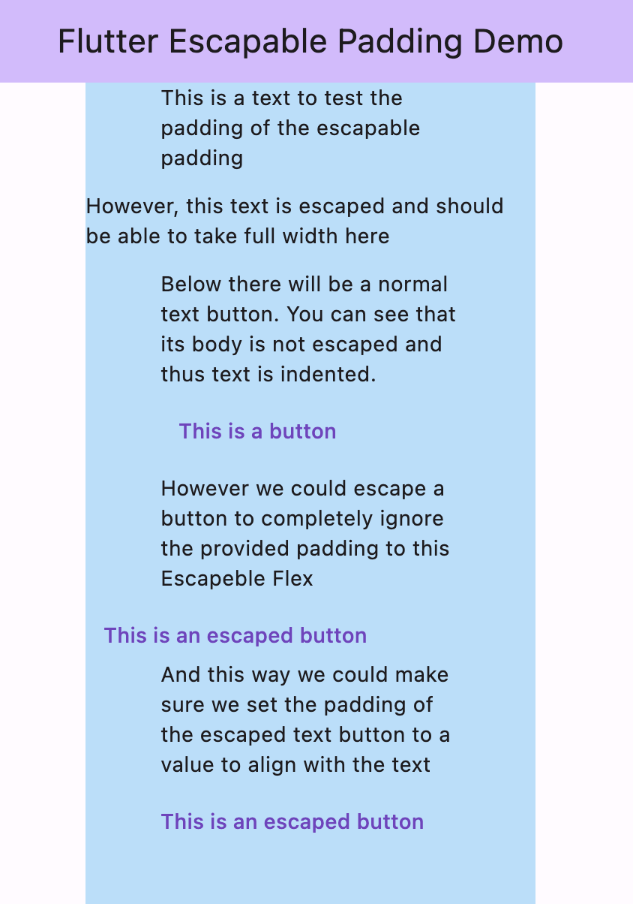

# Escapable Padding
[](https://pub.dev/packages/very_good_analysis) 


Ever wanted to add padding to all items in a list *but with one exception*? Usually this would make you manually add padding to all children except the one you don't want to pad. With Escapable Padding you can pad all items in a Flex, Column or Row, and wrap exceptions with an Escape widget to make them break out of that padding.

This is really nice for (for example):
- Lining up your buttons with your text
- Adding a max viewport width, but having a full size image pop out somewhere as an exception


## Features

Add padding to your Column's, Row's and Flex's with exceptions!



## Getting started

Getting started is really easy just add `escapable_padding` to your pubspec.yaml;

```yaml
dependencies:
  escapable_padding: ^1.0.0
  flutter:
    sdk: flutter
```

## Usage

Usage is really simple too! Just wrap your Column, Row or Flex in a EscapablePadding widget and provide a padding.

```dart
EscapablePadding(
  padding: const EdgeInsets.symmetric(horizontal: 50),
  flexChild: Column(
    crossAxisAlignment: CrossAxisAlignment.start,
    children: [
      const Text('This is a text is affected by the padding provided'),
      const Escaped(
        child: Text('However, this text is escaped and should be able to take full width here'),
      ),
    ],
  ),
),
```

## Additional information

- Since this package only makes use of basic Flutter Widgets, this has no dependencies on other pacakges. This makes including Escapable Padding really safe!
- Currently it is not supported to add horizontal padding to a horizontal flex widget and add vertical padding to a vertical flex widget. 

